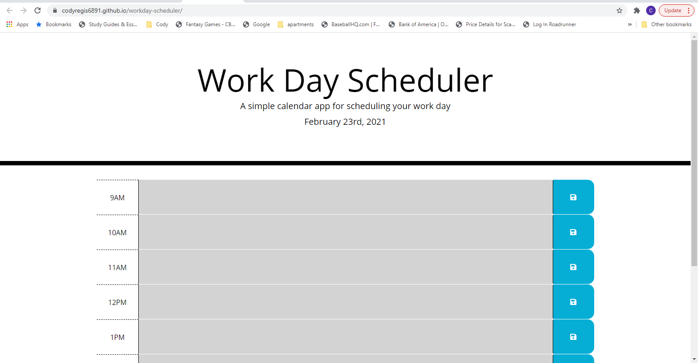

# Workday Scheduler

## License

[](https://opensource.org/licenses/MIT)


## Description

This is a simple yet effective application that allows you to plan out your work day.  The user is able to add tasks or activities for the day in hourly intervals, in order to help them see what lies ahead each day.

## Installation

1. Clone the Repo
  ```sh
  git@github.com:codyregis6891/workday-scheduler.git
  ```
2. View on your browser via localhost
  ```sh
  Right-click on index.html in VSCode, then click on "Open in Default Browser"
  ```
  
## Live Application

Below is a screenshot of the application as well as a link to the live app.

https://codyregis6891.github.io/workday-scheduler/




## Questions or Issues?

* Email: codyregis6891@yahoo.com
* https://github.com/codyregis6891/workday-scheduler/issues
